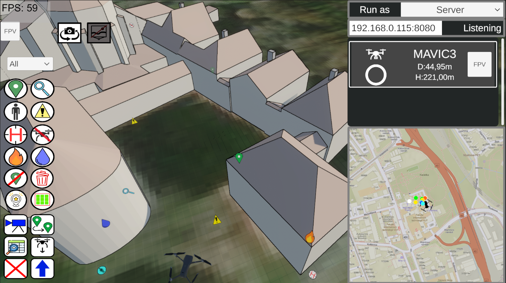
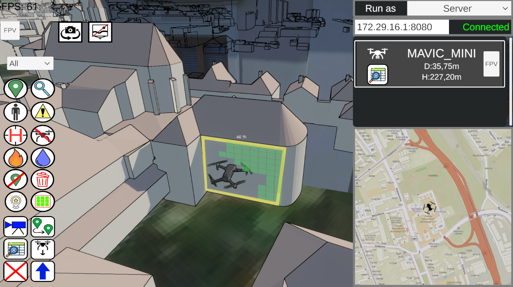
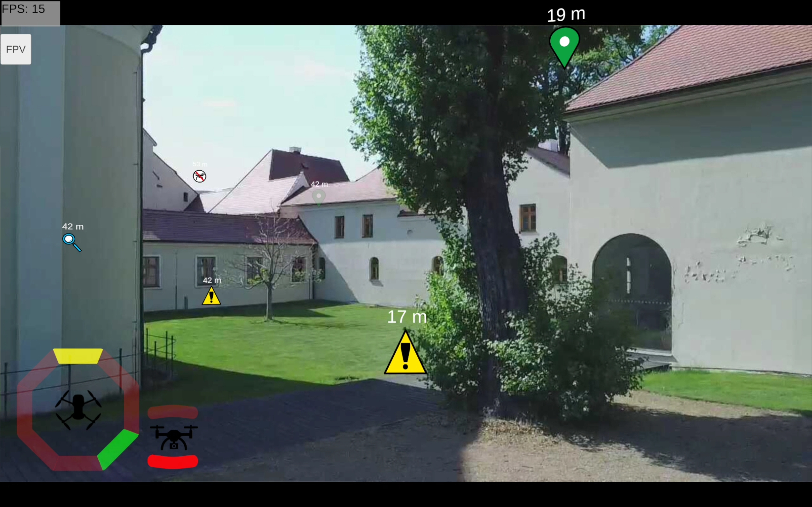

# DroCo - Pilot-Commander Communication Extension (Bachelor Thesis - Visualization Tool for a Drone Pilot)
This branch of DroCo project presents an extension that was developed as a part of bachelor thesis. The extension enables real-time communication, shared annotations, and area exploration tracking between mission commanders and drone pilots through multiple instances of DroCo. Tested on Unity version 2022.3.23f1.

Link to the thesis: [bachelor thesis](http://hdl.handle.net/11012/254537)

## What's new
- 2 new modes of app: Commander and Pilot mode
- Network communication system enabling real-time data sharing between commander and pilot instances

### Commander Mode
- View positions and video screens of all pilots in real-time
- Create annotations in form of marks on the map which are visible for pilots (all or selected ones)
- Highlight specific annotations to set the current task for pilots
- Create an area to explore for the pilot which is filled as the pilot explores given area
- Both annotations and area to explore are visible in AR mode
- Send instructions to the pilots
- Switch between AR views of different pilots




### Pilot Mode
- Use AR mode (recommended)
- View commander annotations in AR
- Current task indicator - arrow guides pilot to highlighted annotation when outside field of view
- Area exploration tracking
- Proximity visualization - octagon display shows nearby objects
- Upper and lower proximity indicators in the bottom-left corner of the screen
- See other pilots' positions marked with red squares



## Example of Running the System
### Requirements
- One Android device for the **DroneDJIStreamer** application - [drone_dji_streamer](https://github.com/robofit/drone_dji_streamer)
- **For Pilot:** Android tablet (recommended)
- **For Commander:** PC (Windows) or Android tablet

### Procedure
- Connect the mobile device to the drone controller via USB cable and launch **DroneDJIStreamer**.  
- On the second pilot's device (tablet), run **DroCo** and select **Pilot** from the dropdown menu in the top-right corner.  
- In the second row with the IP address, you will see **Listening** — copy this IP address and port.  
- In DroneDJIStreamer, click **Server**, paste the address, and press **Connect**.  
  The drone’s video feed should now appear (or press **Live** if needed).  
- For the commander application, launch a second instance of **DroCo** (PC or Android) and select **Server**.  
- Copy the IP address from the commander instance and paste it into the first DroCo instance in the row labeled **Disconnected**.  
- Both applications will now connect. In both instances (Pilot and Commander), the status will show **Connected** and you will see the drone model along with the camera feed.

## Development Requirements
- **Unity** version: 2022.3.23f1  
- **ArcGIS** developer account (required for obtaining an API key)

### Project Dependencies and Setup
#### Unity Package Manager
The project uses packages listed in the `dependencies` section of  
`Packages/manifest.json`, for example:

- `com.unity.render-pipelines.universal`
- `com.esri.arcgis.maps-sdk`
- ...
#### External SDKs
- **ArcGIS Maps SDK**
- **DJI SDK**
- 
## DroCo – Multi-Drone Control Vizualization Tool
[DroCo (VSTool)](https://www.fit.vut.cz/research/product/647/.en) is a tool for effective drone remote control using mixed reality, that also supports communication and cooperation on a mission with multiple drones. The proposed solution is developed by [Robo@FIT, Brno University of Technology](https://www.fit.vut.cz/research/group/robo/.en) research group, and is inspired by the high mental load of the pilot in the control of the drone, especially in the performance of more complex missions (multiple drones, remote target, proximity to infrastructure etc.). The system is based on the extension of the 3D virtual model with real data (augmented virtuality).

## Installation
 - Install [UnxUtils](https://sourceforge.net/projects/unxutils/) to be able to patch ArcGIS scripts using patch_arcgis.bat script. 

- This extension is available as the `ar_communication` branch. You can clone either from the original repository or from this fork:
    **From original repository:**
    ```bash
    git clone git@github.com:robofit/drone_vstool.git
    cd drone_vstool
    git checkout ar_communication
    ```

    **Or from this fork (ar_communication is default):**
    ```bash
    git clone git@github.com:valkuba/drone_vstool.git
    cd drone_vstool
    ```

 - Get submodules:
   ```bash
   cd drone_vstool
   git submodule update --init
   ```
 - Create a symlink of the submodules to the Assets folder:
   ```bash
   .\scripts\link_submodules.bat
   ```
 - Download multimedia files from LFS:
   ```bash
   git lfs install
   git lfs pull
   ```
 - Patch ArcGIS scripts:
   ```bash
   .\scripts\patch_arcgis.bat
   ```
### Setup ArcGIS
 - Create ArcGIS developer account and [create your API Key](https://developers.arcgis.com/documentation/security-and-authentication/api-key-authentication/tutorials/create-an-api-key/).
 - Paste the API Key to `ProjectSettings -> ArcGIS Maps SDK -> API Key`.

### Setup GStreamer (optional, not required)
 - Install GStreamer [1.20.1](https://gstreamer.freedesktop.org/data/pkg/windows/1.20.1/) – install both, regular and devel version based on your computer's architecture (msvc and x86_64 works for me).
 - Add gstreamer binary folder path to System Environment Variables – `Computer -> System properties -> Advanced System Settings -> Advanced Tab -> Environment Variables... -> System Variables -> Variable: Path -> Edit -> New -> C:\gstreamer\1.0\msvc_x86_64\bin`
 - Create new system variable – `New Variable: GST_SDK_PATH= C:\gstreamer\1.0\x86_64\`
 - If GStreamer is still not working inside Unity, try to install or reinstall the latest [MSVC redistributable libraries](https://learn.microsoft.com/en-us/cpp/windows/latest-supported-vc-redist?view=msvc-170).

## Publications
 - [HUBINÁK, Róbert. Application for Efficient Drone Control Using Augmented Virtuality. Brno, 2020. Bachelor's thesis. Brno University of Technology, Faculty of Information Technology. Supervised by Beran Vítězslav.](https://www.fit.vut.cz/study/thesis-file/22839/22839.pdf)
 - [SEDLMAJER Kamil, BAMBUŠEK Daniel a BERAN Vítězslav. Effective Remote Drone Control Using Augmented Virtuality. In: Proceedings of the 3rd International Conference on Computer-Human Interaction Research and Applications 2019. Vienna: SciTePress - Science and Technology Publications, 2019, s. 177-182. ISBN 978-989-758-376-6.](https://www.fit.vut.cz/research/publication/12006/.en)
 - [SEDLMAJER, Kamil. User interface for drone control using augmented virtuality. Brno, 2019. Master's Thesis. Brno University of Technology, Faculty of Information Technology. 2019-06-14. Supervised by Beran Vítězslav.](https://www.fit.vut.cz/study/thesis-file/16730/16730.pdf)
